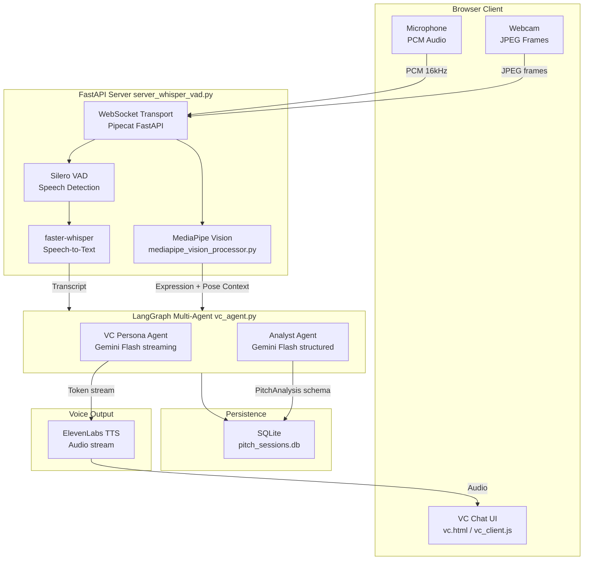
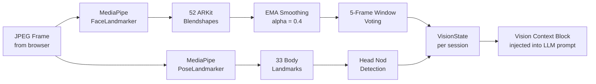

<div align="center">

<!-- Animated banner-style header -->


<br/>

<p>
  
  
  
  
  
  
</p>

<p>
  
  
  
  
  
</p>

<br/>

> **The world most realistic AI venture capital pitch practice simulator.**
> Real-time speech recognition · Concurrent multi-agent AI · Live body language analysis

<br/>

[**Live Demo**](#-getting-started) · [**Docs**](#-architecture) · [**Issues**](https://github.com/smit-faldu/prepmate/issues) · [**Contribute**](#-contributing)

</div>

---

## What is PrepMate?

**PrepMate** is a full-stack, real-time AI pitch simulation platform that puts founders in front of a virtual Venture Capitalist — before they face a real one. It combines:

- **Local Whisper STT** — Offline, private, low-latency speech recognition with VAD (Voice Activity Detection)
- **Concurrent LangGraph Agents** — A VC Persona agent streams live replies while an Analyst agent runs in parallel
- **MediaPipe Computer Vision** — Face & pose landmark analysis that reads your confidence in real time
- **ElevenLabs TTS** — The AI VC responds in a realistic voice
- **SQLite Session Persistence** — Full turn-by-turn pitch history saved locally

```
You speak → Whisper transcribes → VC responds in <1s + Vision analyzes your body language
```

---

## Feature Highlights

<table>
<tr>
<td width="50%">

### Dual-Agent Intelligence
- **VC Persona Agent** — streams in-character replies instantly
- **Analyst Agent** — runs concurrently, extracting structured pitch metrics
- Zero sequential blocking — user hears first tokens in ~1s

</td>
<td width="50%">

### Real-Time Vision Analysis
- **52 ARKit blendshape coefficients** from MediaPipe FaceLandmarker
- **8 facial expressions** recognized (happy, surprised, angry, sad + more)
- **EMA temporal smoothing** (alpha=0.4) eliminates jitter
- **5-frame sliding window** prevents expression flickering

</td>
</tr>
<tr>
<td width="50%">

### Offline Speech Recognition
- **faster-whisper** — runs fully on-device (CUDA or CPU)
- **Silero VAD** — detects speech start/stop with <200ms latency
- Auto compute-type selection: `float16` (GPU) or `int8` (CPU)
- Interim transcripts stream as you speak

</td>
<td width="50%">

### Low-Latency Architecture
- **WebSocket-first** communication via Pipecat + FastAPI
- **Concurrent asyncio** — no sequential call chains
- **Streaming token delivery** — persona reply starts before analysis completes
- **SQLite checkpointer** — instant session restore

</td>
</tr>
</table>

---

## Architecture



---

## Concurrent Agent Pipeline

The secret to PrepMate's low latency is its **non-blocking dual-agent design**:

```
Human Speech Turn
      |
      +──────────────────────────+──────────────────────────────────────+
      v                          v
[VC Persona Agent]           [Analyst Agent]
Streams in-character reply   Runs concurrently in background.
IMMEDIATELY using previous   Extracts structured PitchAnalysis:
turn's metrics.              - product / traction / team / ask
                             - stage (seed/series-a/...)
User hears first tokens      - red_flags / exit_condition
in ~1 second.                Feeds into NEXT turn's persona prompt.
      |
      +──────────────────────────+
                    v
            State persisted to SQLite (SqliteSaver checkpoint)
```

> Running them **concurrently** instead of sequentially gives the latency win without trading away analysis quality. The analyst's output lags by one turn — imperceptible in a live conversation.

---

## Vision Pipeline



**Recognized Expressions:** `neutral` · `happy` · `surprised` · `disgusted` · `fearful` · `angry` · `sad` · `contempt`

**Body Language:** Eye contact score · Head nodding · Gesture activity · Posture confidence rating (1–5 scale)

---

## Project Structure

```
prepmate/
|
+-- server_whisper_vad.py         # FastAPI server + Pipecat pipeline orchestrator
+-- vc_agent.py                   # LangGraph multi-agent VC pitch evaluator
+-- mediapipe_vision_processor.py # MediaPipe face + pose analysis pipeline
+-- cli_whisper_vad.py            # CLI mode — test STT without the web UI
|
+-- templates/
|   +-- index.html                # STT demo page (Whisper streaming test)
|   +-- vc.html                   # Main VC pitch simulator interface
|
+-- static/
|   +-- css/
|   |   +-- styles.css            # Global styles
|   |   +-- vc_styles.css         # VC interface styles
|   +-- js/
|       +-- client.js             # Base WebSocket audio client
|       +-- vc_client.js          # VC interface controller
|       +-- vision_client.js      # Webcam capture & vision frame sender
|       +-- pcm-processor.js      # AudioWorklet PCM downsampler
|
+-- models/
|   +-- face_landmarker.task      # MediaPipe face model (download separately)
|   +-- pose_landmarker_full.task # MediaPipe pose model (download separately)
|
+-- requirements.txt              # Python dependencies
+-- .env                          # API keys + configuration (not committed)
+-- .gitignore
```

---

## Tech Stack

| Layer | Technology | Purpose |
|-------|-----------|---------|
| **Web Server** | FastAPI + Uvicorn | Async HTTP & WebSocket server |
| **Real-time Audio** | Pipecat AI | Audio pipeline, VAD, transport |
| **Speech Recognition** | faster-whisper (local) | Offline STT, CUDA/CPU auto-select |
| **Voice Activity Detection** | Silero VAD | Speech start/stop detection |
| **AI Agents** | LangGraph + LangChain | Multi-agent state machine |
| **LLM** | Google Gemini Flash | VC Persona + structured analysis |
| **Computer Vision** | MediaPipe Tasks | Face + pose landmark analysis |
| **Image Processing** | OpenCV (headless) | Frame preprocessing |
| **Text-to-Speech** | ElevenLabs | Realistic VC voice output |
| **Persistence** | SQLite + LangGraph checkpointer | Session state & history |
| **Logging** | Loguru | Structured async-safe logging |

---

## Getting Started

### Prerequisites

- Python 3.10+
- CUDA GPU *(optional but recommended for real-time Whisper)*
- Google Gemini API key
- ElevenLabs API key *(optional — TTS can be disabled)*

### 1. Clone the Repository

```bash
git clone https://github.com/smit-faldu/prepmate.git
cd prepmate
```

### 2. Create and Activate Virtual Environment

```bash
python -m venv .venv

# Windows
.venv\Scripts\activate

# macOS / Linux
source .venv/bin/activate
```

### 3. Install Dependencies

```bash
pip install -r requirements.txt
```

### 4. Download MediaPipe Models

```bash
mkdir -p models

# Face Landmarker
wget -O models/face_landmarker.task \
  https://storage.googleapis.com/mediapipe-models/face_landmarker/face_landmarker/float16/latest/face_landmarker.task

# Pose Landmarker (Full — higher accuracy)
wget -O models/pose_landmarker_full.task \
  https://storage.googleapis.com/mediapipe-models/pose_landmarker/pose_landmarker_full/float16/latest/pose_landmarker_full.task
```

### 5. Configure Environment

Create a `.env` file in the project root:

```env
# Google AI
GOOGLE_API_KEY=your_gemini_api_key_here

# ElevenLabs TTS
ELEVENLABS_API_KEY=your_elevenlabs_key_here
ELEVENLABS_VOICE_ID=your_voice_id_here
TTS_ENABLED=true

# Whisper Configuration
WHISPER_MODEL=base          # tiny | base | small | medium | large-v3
WHISPER_DEVICE=auto         # auto | cpu | cuda
WHISPER_LANGUAGE=en         # en | hi | auto (for multilingual)

# Logging
LOG_LEVEL=INFO
```

### 6. Launch the Server

```bash
uvicorn server_whisper_vad:app --host 0.0.0.0 --port 8000 --reload
```

### 7. Open the VC Simulator

```
http://localhost:8000/vc
```

Allow microphone & webcam access, then start pitching!

---

## Usage Guide

| Action | How |
|--------|-----|
| **Start Session** | Open `/vc`, click **Connect** |
| **Pitch** | Click the mic button and speak naturally — Whisper transcribes in real-time |
| **Get Feedback** | VC replies within ~1s via text + voice |
| **Vision Analysis** | Webcam auto-starts — body language is analyzed continuously |
| **Test STT Only** | Open `/` for the standalone Whisper streaming demo |
| **CLI Mode** | `python cli_whisper_vad.py` for terminal-only STT testing |

---

## Performance Metrics

```
+------------------------------------------------------------------+
|                  PrepMate Performance Profile                     |
+-------------------------+-------------------+-------------------+
| Metric                  | GPU (CUDA)        | CPU               |
+-------------------------+-------------------+-------------------+
| Whisper (tiny model)    | ~50ms / utterance | ~150ms / utterance|
| VAD detection latency   | < 100ms           | < 100ms           |
| First VC token          | ~800ms            | ~1200ms           |
| Vision frame analysis   | ~20ms / frame     | ~60ms / frame     |
| Whisper compute type    | float16           | int8              |
+-------------------------+-------------------+-------------------+
```

### Whisper Model Comparison

```
Model     |  Size  |  Speed  |  WER     |  Best For
----------+--------+---------+----------+----------------------
tiny      |  75 MB | ######  |  ~15%    |  Development / Testing
base      | 145 MB | #####   |  ~10%    |  Balanced (recommended)
small     | 465 MB | ####    |  ~7%     |  Higher accuracy
medium    | 1.5 GB | ###     |  ~5%     |  Production quality
large-v3  | 3.0 GB | ##      |  ~3%     |  Maximum accuracy
```

---

## Configuration Reference

| Variable | Default | Description |
|----------|---------|-------------|
| `GOOGLE_API_KEY` | — | Gemini API key (required) |
| `ELEVENLABS_API_KEY` | — | ElevenLabs key (required if TTS on) |
| `TTS_ENABLED` | `true` | Enable/disable voice output |
| `WHISPER_MODEL` | `tiny` | Whisper model size |
| `WHISPER_DEVICE` | `auto` | `auto` / `cpu` / `cuda` |
| `WHISPER_LANGUAGE` | `en` | Language code or `auto` for multilingual |
| `WHISPER_COMPUTE_TYPE` | auto | Override: `float16` / `int8` / `float32` |
| `LOG_LEVEL` | `DEBUG` | `DEBUG` / `INFO` / `WARNING` |

---

## Roadmap

- [x] Real-time Whisper STT with VAD
- [x] Concurrent LangGraph dual-agent pipeline
- [x] MediaPipe face + pose analysis
- [x] ElevenLabs TTS voice output
- [x] SQLite session persistence
- [x] 8-expression vocabulary with blendshape scoring
- [ ] Post-session pitch analytics dashboard
- [ ] Multiple VC persona profiles (e.g., Y Combinator, Sequoia, a16z styles)
- [ ] Pitch deck PDF upload & visual analysis
- [ ] Cloud deployment (Docker + Railway/Render)
- [ ] Progress tracking across multiple sessions
- [ ] Multilingual pitch support

---

## Contributing

Contributions are warmly welcome! Here's how to get started:

```bash
# 1. Fork the repository on GitHub

# 2. Clone your fork
git clone https://github.com/YOUR_USERNAME/prepmate.git

# 3. Create a feature branch
git checkout -b feature/amazing-feature

# 4. Make your changes and commit
git commit -m "Add amazing feature"

# 5. Push and open a Pull Request
git push origin feature/amazing-feature
```

Please follow these guidelines:
- Keep PRs focused and atomic
- Add comments for non-obvious logic
- Update the README if you add major features
- Test both GPU and CPU paths if touching the STT pipeline

---

## License

This project is licensed under the **MIT License** — see the [LICENSE](LICENSE) file for details.

---

## Acknowledgements

| | | |
|--|--|--|
| [Pipecat AI](https://pipecat.ai) | [MediaPipe](https://developers.google.com/mediapipe) | [LangGraph](https://github.com/langchain-ai/langgraph) |
| [faster-whisper](https://github.com/SYSTRAN/faster-whisper) | [Google Gemini](https://ai.google.dev/) | [ElevenLabs](https://elevenlabs.io) |

---

<div align="center">

**Built with love by [smit-faldu](https://github.com/smit-faldu)**

*If PrepMate helped you nail your pitch — give it a star and spread the word!*


</div>
